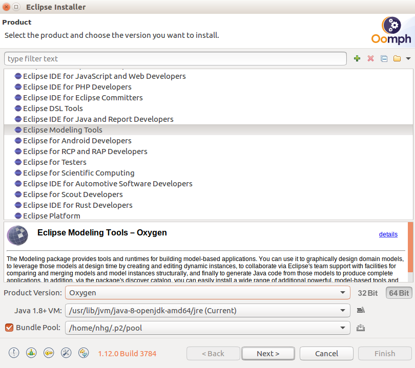
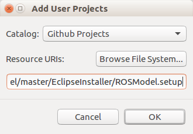
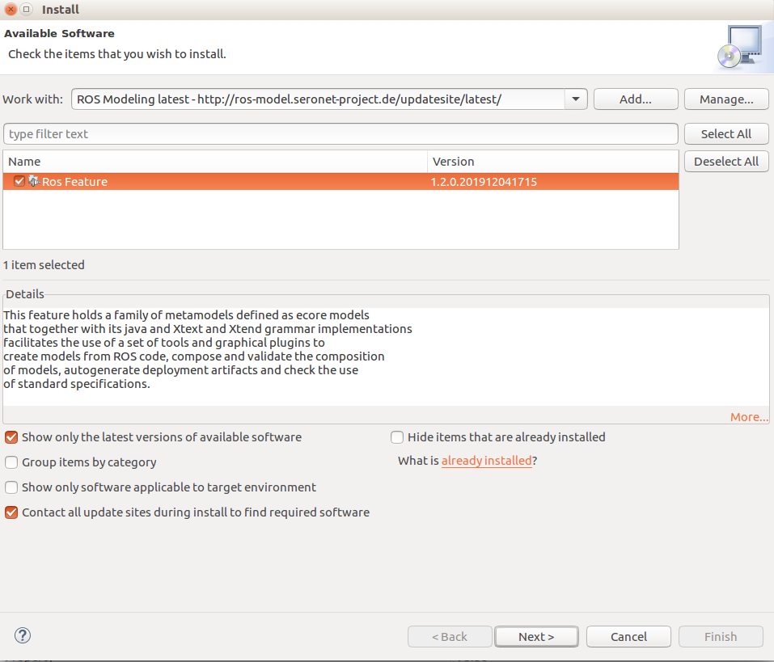
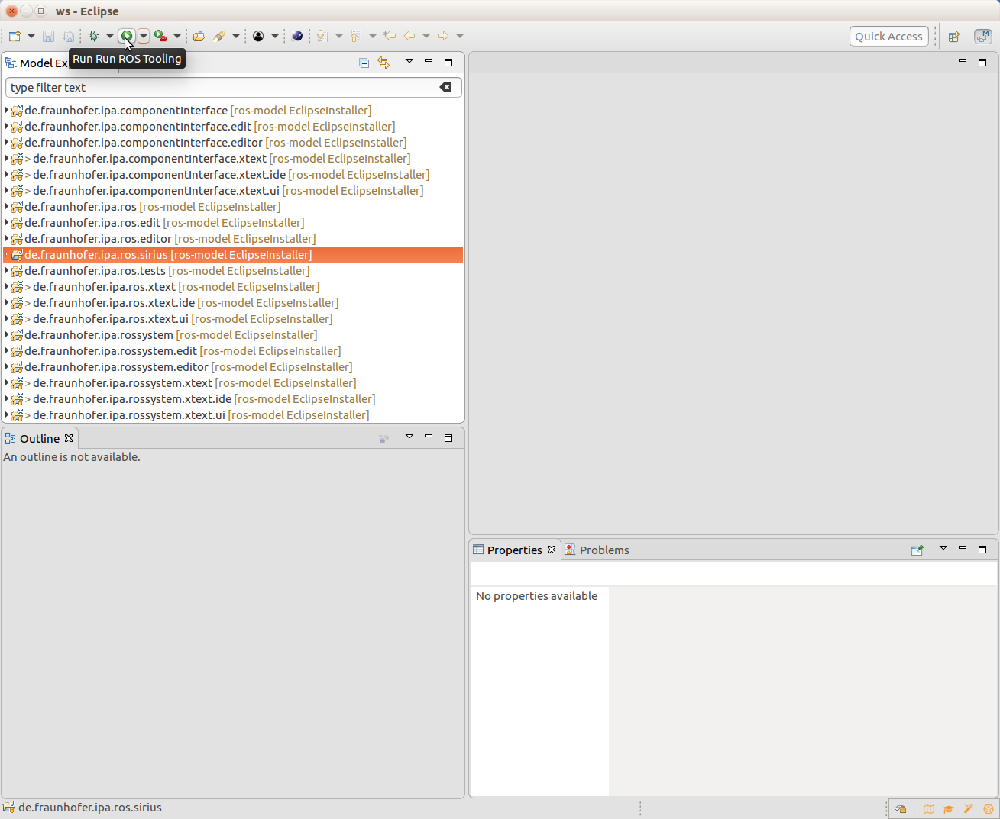
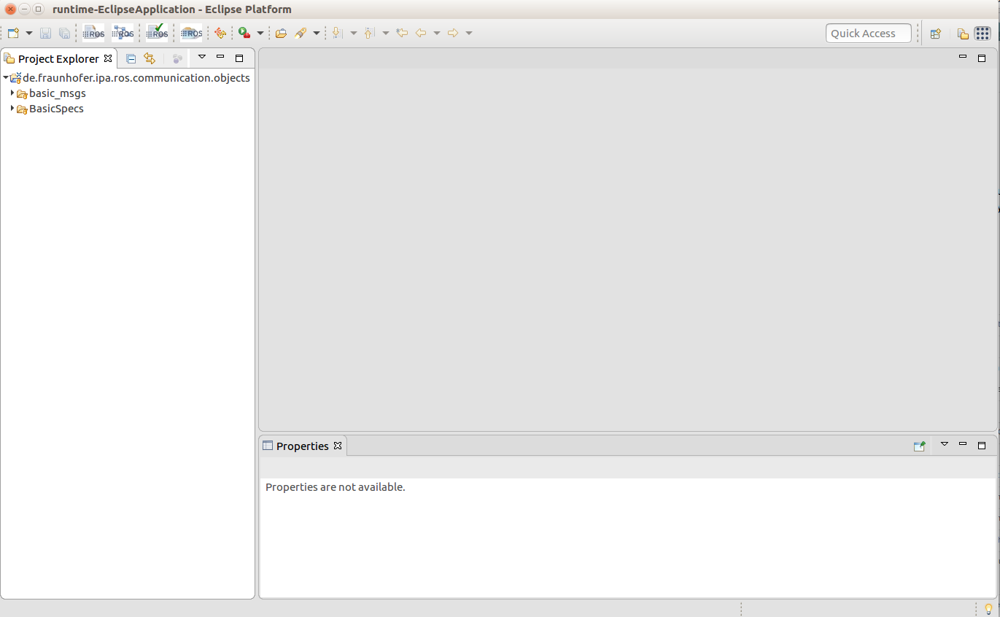

# Ros Model

[](https://opensource.org/licenses/BSD-3-Clause)

Technical Maintainer: [**ipa-nhg**](https://github.com/ipa-nhg/) (**Nadia Hammoudeh Garcia**, **Fraunhofer IPA**) - **nadia.hammoudeh.garcia@ipa.fraunhofer.de**

This repository holds a family of metamodels defined as ecore models that together with its java and Xtext and Xtend grammar implementations facilitates the use of a set of tools and graphical plugins to create models from ROS code, compose and validate the composition of models, autogenerate deployment artifacts and check the use of standard specifications.

For further information about the metamodels, please check the [IRC19 paper](https://ieeexplore.ieee.org/document/8675668)

### Installation

#### Option 1: Using the Eclipse Installer

Download the official [Eclipse Installer](https://www.eclipse.org/downloads/packages/installer) for your preferred operating system. Execute the installer and choose the advanced mode (menu on the right-up corner). Select the Product *Eclipse Modeling tools* package, for the version it is recommended use *2018-12*.



Press *Next* and add a new *User project* pressing the green button *+*:
```
Catalog: Github Projects
Resource URIs: https://raw.githubusercontent.com/ipa320/ros-model/master/EclipseInstaller/ROSModel.setup
```


Select the the ROS Model project (under Github Projects -> <User>) and press next. 

By default the ROS tooling installation will be saved under the folder *ros-model-master* in your home directory. In case your github credentials are not setup on your machine, change the *Ros model Github repository* to the *HTTPs(read-write)* option.

Follow the installation instructions of the Oompth installer dialog, after the installation eclipse will be restarted to launch the ROS tooling configuration. Finally, when all the startup tasks finished press "Worbench".

#### Option 2: Using an update site URL

In Eclipse, go to *Help* > *Install New Software...*. To install the latest version of the ROS tooling, add the update site URL [http://ros-model.seronet-project.de/updatesite/latest/](http://ros-model.seronet-project.de/updatesite/latest/) in the *Work with* section. If you wish to install an earlier version instead, go to the [the update site](http://ros-model.seronet-project.de/updatesite/), choose the desired version and copy its URL.



The category *ROS Model* appears in the *Name* area. Check the box in front of *ROS model* and click *Next* to review the list of items to be installed. Click *Next* again to read and accept the terms of the license agreements and afterwards click *Finish*. Eclipse will then start to install the ROS tooling and its dependencies. Click *OK* on the security warning. Finally, when asked, restart Eclipse to complete the installation process.

### Setup the environment and start the eclipse application

1. Start the ROS tooling:
* In case you have installed the tooling using the Eclipse Installer, select de.fraunhofer.ipa.ros.sirius and press the button *Run*



Otherwise, switch to the "ROS developer" perspective (Menu Window -> Perspective -> Open Perspective -> Other... -> ROS developer). Your application toolbar will be automatically configured.

2. Import the common communication objects project (under the "examples" folder of this repository) to the workbench of your application:
```
de.fraunhofer.ipa.ros.communication.objects
```

Now that your workspace is setup, you can start creating your [project and defining your ROS system](#Tutorials)



## Tutorials

* [Create new ROS projects and define ROS nodes](docu/NewProject.md)
* [Create a ROS model from cpp code](docu/NewRosModel.md)
* [Generation of code from models](docu/CodeGeneration.md)
* [Define a ROS system as a composition of components](docu/NewSystem.md)
* [Compare your model with a Specification](docu/CompareSpec.md)
* [Add communication objects](docu/NewCommunicationObjects.md)
* [Model extraction using introspection at runtime](https://github.com/ipa-led/ros_graph_parser)
* [Introspection at design-time](docu/simulateRuntime.md)

## Model examples

The [ros-model-experiments](https://github.com/ipa-nhg/ros-model-experiments/) reposirory holds some examples o models autogenerated using the tooling and its facilities.
