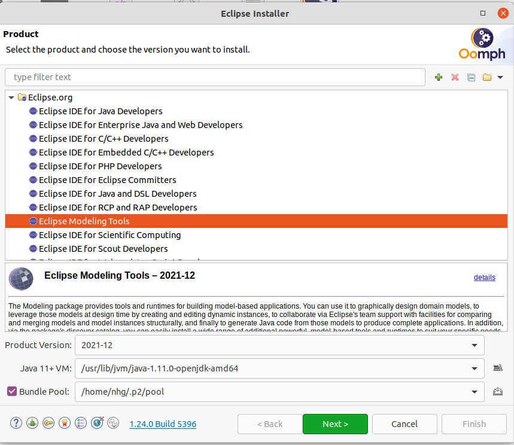

# Ros Model

[](https://opensource.org/licenses/BSD-3-Clause)

Technical Maintainer: [**ipa-nhg**](https://github.com/ipa-nhg/) (**Nadia Hammoudeh Garcia**, **Fraunhofer IPA**) - **nadia.hammoudeh.garcia@ipa.fraunhofer.de**

1. <a href="#1--intro">Introduction</a>
2. <a href="#2--installation-requirements">Installation</a>
3. <a href="#3--start">Setup the work environment and start the software</a>
4. <a href="#4--tutorials">Usage</a>
5. <a href="#5--tools">Tools: Auto-extraction of ROS models from static code analysis (HAROS)</a>

## Introduction <a id="1--intro"/>

This repository holds a family of models and its eclipse plugins to start MDE tools and:
- Define ROS nodes as a structured model that impose the use of ROS Best Practices
- Compose ROS nodes and define the runtime namespaces to start the nodes
- Validate the composition by checking at design time the future runtime connections
- Autogeneration of a launch file with the remaps and namespaces tags needed to ensure the communication

For all the steps graphical editors and wizards are available to guide the user.

The description of a ROS system is divided into 3 metamodels:

-**ROS Metamodel**: A model that encapsule all the ROS basic concepts: filesystem level, computational graph and deployment mechanisms. This model is completed with a Xtext grammar to enforce the use of standard and existing ROS mesages and assurance the use of ROS naming conventions. 

-**Component Interface Metamodel**: Adaptation of the concept of Component Interface of the OMG specification standard [Deployment and Configuration of Component-based Distributed Applications](https://www.omg.org/spec/DEPL/About-DEPL/) from a ROS node. This concept enables the use of the same model to describe monolithic ROS nodes and large ROS systems and 1) simplifies the deployment process of ROS systems (by composing sub-systems) and 2) facilitates the interconnection of a ROS application with other component-based architecture frameworks.


-**System Metamodel**: This metamodel allow the definition of a System (as a composition of Component Interfaces) and the conections between them. The tool validates at-design time the connections by evaluating 1) the no disparity of communication objects (messages or services) and 2) the no disparity of topics or services names.


## Installation and setup requirements <a id="2--installation-requirements"/>

Download the official [Eclipse Installer](https://www.eclipse.org/downloads/packages/installer) for your preferred operating system. Execute the installer and choose the advanced mode (menu on the right-up corner). Select the Product *Eclipse Modeling tools* package, for the version it is recommended use *Oxygen*.



Press *Next* and add a new *User project* pressing the green button *+*:
```
Catalog: Github Projects
Resource URIs: https://raw.githubusercontent.com/ipa320/ros-model/master/EclipseInstaller/ROSModel.setup
```


Select the the ROS Model project (under Github Projects -> <User>) and press next. 

By default the ROS tooling installation will be saved under the folder *ros-model-master* in your home directory. In case your github credentials are not setup on your machine, change the *Ros model Github repository* to the *HTTPs(read-write)* option.

Follow the installation instructions of the Oompth installer dialog, after the installation eclipse will be restarted to launch the ROS tooling configuration. Finally, when all the startup tasks finished press "Worbench".

## Setup the work environment and start the software <a id="3--start"/>

#### Setup the environment and start the eclipse application


1. Start the ROS tooling:
* select de.fraunhofer.ipa.ros.siriusand press the button *Run*


2. Import the common communication objects project (under the "examples" folder of this repository) to the workbench of your application:
```
de.fraunhofer.ipa.ros.communication.objects
```

Now that your workspace is setup and the eclipse application running you can start creating your project and defining your ROS system


## Usage <a id="4--tutorials"/>

To play with the tool please follow our [tutorials](docu/README.md).

## Usage <a id="5--tools"/>

To avoid errors creating models we provide [tools](tools/README.md).:

1. Create ROS models from exixting ros nodes
2. Provide new ROS messages, services and actions types

:bangbang: these tools require a ROS installation.
