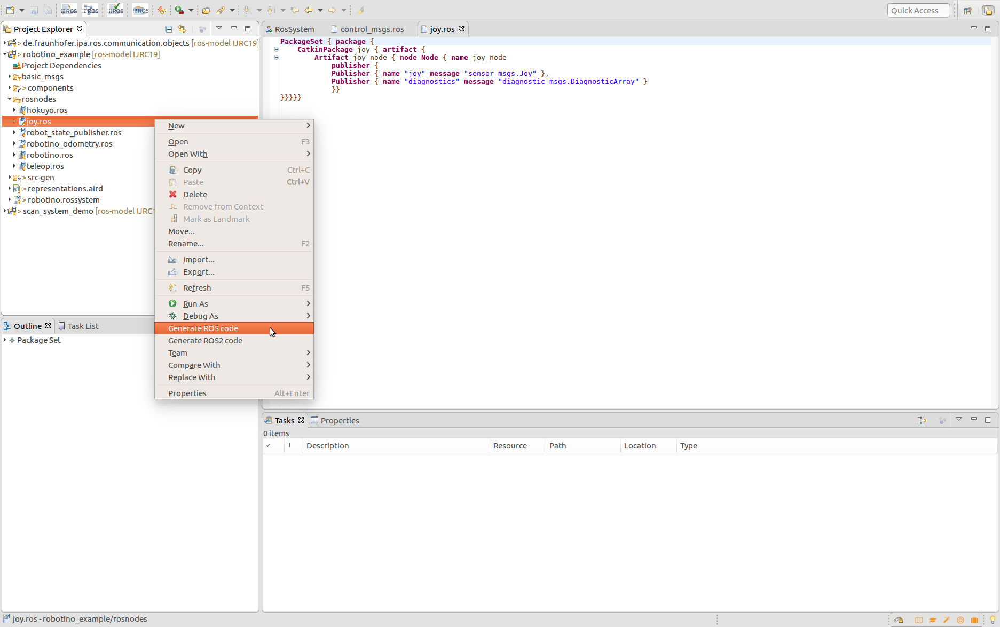

## Code generation from models

### From ROS model

As complement to the option of extract automatically models from source code, the tooling supports complementary the opposite direction: the generation of code from ROS models. As this step is optional, it will not be performed automatically and the user have to trigger it by a right clicking a right click on the ROS model file (*.ros). The function offer two possibilities: generate ROS1 or ROS2 code.

### From System model

For the System model the generation of code it is automatic, that means if your model is correct and do not infringe the connection rule (like join interfaces with mismatched types) Xtext will automatically generate into the *src-gen* folder of your project the following files:

* launch file: to launch all the defined components together, to ensure the desired connections the interfaces will be properly remapped. Also the generator will handle the definition of namespaces
* installation script: an executable script to install all the required ROS interfaces needed to run the previous launch file. In case none ROS installation is found on the system, the script will drive the user to install it.
* A component interface model: this model summarizes the full system as a single block, that can be imported to form new systems from subsystems or used to inter operate with other frameworks. See [ROS Systems tutorial](NewSystem.md)
