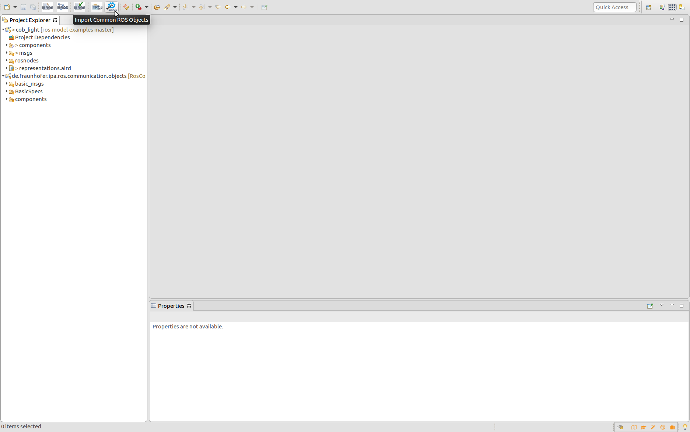

# Setup the environment and start the eclipse application

### 0: Start the ROS tooling application

:bangbang::bangbang: This is only needed if you installed the toolig from [source](#option-2-using-the-eclipse-installer---source-installation-ros-tooling-developers), if you installed the release version please continue directly with the [step 1](#1-switch-to-the-ros-developer-perspective)

select de.fraunhofer.ipa.ros.plugin and press the button *Run*


### 1: Switch to the ROS Developer perspective

Go to Menu Window -> Perspective -> Open Perspective -> Other... -> ROS developer. Your application toolbar will be automatically configured.

### 2: Import the common communication objects project

import the project located under the "ROSCommonObjects" folder of this repository to the workbench of your application:
```
de.fraunhofer.ipa.ros.communication.objects
```

If you have internet a button can clone from GitHub the objects to your workspace and import them automatically:



Now that your workspace is setup, you can start creating your [project and defining your ROS system](#Tutorials)
