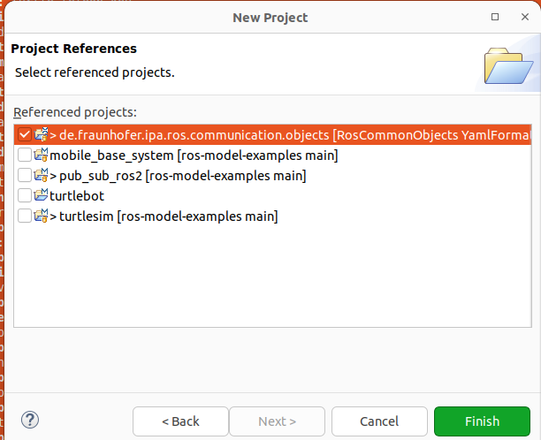

# Hands-on example for the Turtlesim node

To learn ROS one of the first tutoials that everyone does is turtlesim.

Basically it is a small graphical interface where appears a turtle that I can move using the speed commands of any robotic base in ROS. [Official TurtleSim tutorial](https://docs.ros.org/en/foxy/Tutorials/Beginner-CLI-Tools/Introducing-Turtlesim/Introducing-Turtlesim.html)

We will use it as an example to introduce our models. Let's imagine that we want to create a system in which we have two nodes, one of them is the turtlesim and the other is the node to teleoperate it.
The first thing we need to do is to create the models for both components. Both nodes are implemented in the [turtlesim](https://github.com/ros/ros_tutorials/tree/humble/turtlesim) package in the [ros_tutorials](https://github.com/ros/ros_tutorials/tree/humble) repository.

We can create the component models manually or use our static code [analysis tools](https://github.com/ipa320/ros-model-extractors) to get them automatically. Using the second method we obtained the following models.

```
turtlesim:
  fromGitRepo: "https://github.com/ros/ros_tutorials/"
  artifacts:
    turtle_teleop_key:
        node: turtle_teleop_key
        publishers:
          cmd_vel:
            type: "geometry_msgs/msg/Twist"
        parameters:
          scale_angular:
            type: Double
            default: 2.0
          scale_linear:
            type: Double
            default: 2.0
    turtlesim_node:
      node: turtlesim_node
      publishers:
        color_sensor:
          type: "turtlesim/msg/Color"
        pose:
          type: "turtlesim/msg/Pose"
      subscribers:
        cmd_vel:
          type: "geometry_msgs/msg/Twist"
      serviceservers:
        teleport_absolute:
          type: "turtlesim/srv/TeleportAbsolute"
        spawn:
          type: 'turtlesim/srv/Spawn'
        set_pen:
          type: 'turtlesim/srv/SetPen'
        reset:
          type: "std_srvs/srv/Empty"
        kill:
          type: 'turtlesim/srv/Kill'
        teleport_relative:
          type: 'turtlesim/srv/TeleportRelative'
        clear:
          type: 'std_srvs/srv/Empty'
```

To import this as a project in the RosTooling you can create a new modeling project. By File -> New -> Project -> General -> Project. Then you must give a name to the project, for example "turtlesim_example" press next, and add as project reference "de.fraunhofer.ipa.ros.communication.objects"



Once the project is created, you can create a new file my File -> New -> Other -> File. We recommend to give as name to the file the name of the package and its must have the extension .ros2, this means the new file should be called **turtlesim.ros2**. By creating a file type .ros2, Eclipse will convert the project to a Xtext project. Then copy the previous content to the new file.

Now that we have already the components we can compose them. For that we have to create a new .rossystem file. Again go to File -> New -> Other -> File. The new file must have as extension .rossystem.

In [RosSystem description](RosSystemModelDescription.md) we explain the format of a system and the editor will support you to write the model properly.

The first that must be given is a name and then a ":" is required. In the next line you must add identation and you can press the keys "Ctrl" + Space bar for help. 
Firstly, we will add the 2 nodes that compose our system.


So far our file looks like:
```
turtlesim_system:
  nodes:
    turtlesim:
      from: "turtlesim.turtlesim_node"
    key_teleop:
      from: "turtlesim.turtle_teleop_key"
```

Now, we want to expose the ports to be connected. This means the subscriber of the velocity command of the turtle and the publisher from the keyboard teleop:


And the model is updated to:
```
turtlesim_system:
  nodes:
    turtlesim:
      from: "turtlesim.turtlesim_node"
      interfaces:
        - cmd_subscriber: sub-> "turtlesim_node::cmd_vel"
    key_teleop:
      from: "turtlesim.turtle_teleop_key"
      interfaces:
        - cmd_publisher: pub-> "joystick_teleop_node::cmd_vel"
```
The last step is to create the connection between the two components.


And the model is updated to:
```
turtlesim_system:
  nodes:
    turtlesim:
      from: "turtlesim.turtlesim_node"
      interfaces:
        - cmd_subscriber: sub-> "turtlesim_node::cmd_vel"
    key_teleop:
      from: "turtlesim.turtle_teleop_key"
      interfaces:
        - cmd_publisher: pub-> "joystick_teleop_node::cmd_vel"
  connections:
   -[ cmd_publisher , cmd_subscriber]
```

If you save (Ctrl+S) after the last modifications a new folder "src-gen" will be automatically created. This folder contains a ROS2 package ready to be executed with a launch file to start the designed system.

For a quick check, if you source a valid ROS installation and call the launch command the turtlesim example will be launched:

```
source /opt/ros/ROSDISTRO/setup.bash
ros2 launch PATH_TO_LAUNCH_PY_FILE
```

Using the terminal of the keyboard node you can use the arrows to send new commands to the turtle. 


To make use of the new created package in ROS, we recommend to create a ros workspace and add there the package. This means:

```
cd ~
mkdir -p ros2_ws/src
cp PATH_TO_GENERATED_PACKAGE_UNDER_SRC-GEN ros2_ws/src/ -r
cd ros2_ws
rosdep install --from-path src -i -y
colcon build
source install/setup.bash
```

To launch the system, the traditional ros2 launch command can be called:

```
ros2 lanunch turtlesim_system turtlesim_system.launch.py
```
