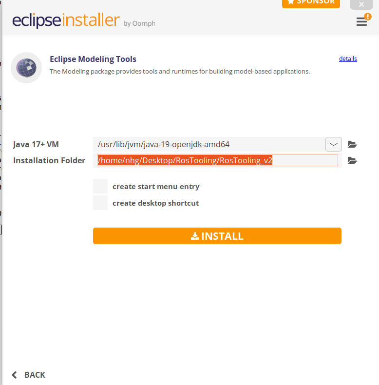

# Installation and setup

### Option 1: Using the Release version (Recommended)

First the java environment have to be setup:

```
sudo apt-get install openjdk-19-jre
```

Then Eclipse can be installes. Please download the installer from the official eclipse [website](https://www.eclipse.org/downloads/packages/installer). Once you start the installer, select the package "Eclipse Modeling Tools".



Press next, and then pick the java version 19 and the folder where you would like to install eclipse.


Continue the installation, acepting the license, as usual.

Once the installation is completed, go to *Help* > *Install New Software...*. To install the latest version of the ROS tooling, add the update site URL [https://raw.githubusercontent.com/ipa320/RosTooling-update-site/main](https://raw.githubusercontent.com/ipa320/RosTooling-update-site/main)(*) in the *Work with* section.


If none package is listed, please uncheck the option *Group items by category*. The category *ROS Model* appears in the *Name* area. Check the box in front of *ROS model* and click *Next* to review the list of items to be installed. Click *Next* again to read and accept the terms of the license agreements and afterwards click *Finish*. Eclipse will then start to install the ROS tooling and its dependencies. If you get a security warning about the authenticity, click OK. Finally, when asked, restart Eclipse to complete the installation process.

To start using the ROS tooling continue with the [step 1](Environment_setup.md/#1-switch-to-the-ros-developer-perspective)


## Alternative installations

### Option 2: Using the Eclipse Installer - Source installation (ROS tooling developers)

First the java environment have to be setup:
```
sudo apt-get install openjdk-19-jre
```
Download the official [Eclipse Installer](https://www.eclipse.org/downloads/packages/installer) for your preferred operating system. Execute the installer and choose the advanced mode (menu on the right-up corner). Select the Product *Eclipse Modeling tools* package. And then pick the java version 19.


Press *Next* and add a new *User project* pressing the green button *+*:
```
Catalog: Github Projects
Resource URIs: https://raw.githubusercontent.com/ipa320/RosTooling/main/EclipseInstaller/ROSModel.setup
```
Sometimes eclipse is not able to find the file, for those cases we recommend to download the file to the local memory of the machine and import it:

```
wget https://raw.githubusercontent.com/ipa320/RosTooling/main/EclipseInstaller/ROSModel.setup
```


Select the the ROS Model project (under Github Projects -> <User>) and press next.

By default the ROS tooling installation will be saved under the folder *ros-model-master* in your home directory. To ensure that you have access to get the source code from GitHub, select the check box *Show all variable* and change the *Ros model Github repository* to the *HTTPs(read-write)* option, verify that the option *Github user ID* is set to "anonymous".


Follow the installation instructions of the Oompth installer dialog, after the installation eclipse will be restarted to launch the ROS tooling configuration. Finally, when all the startup tasks finished press "Workbench".

To start using the ROS tooling continue with the [step 0](Environment_setup.md/#0-start-the-ros-tooling-application)
