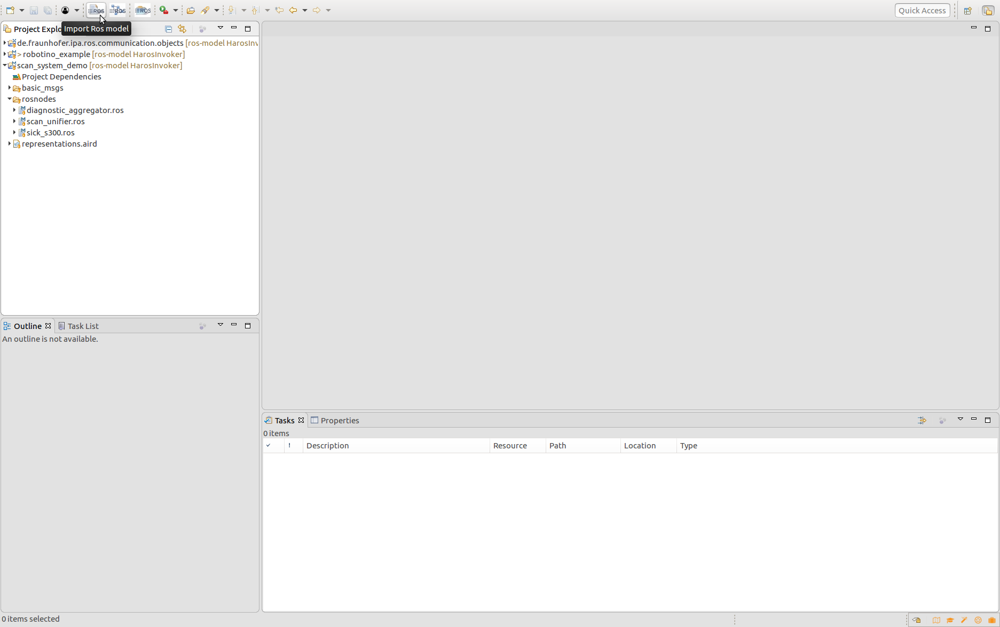
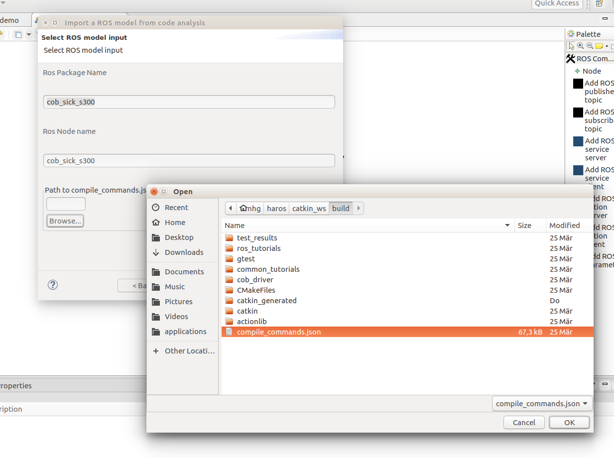

:bangbang::bangbang::bangbang::bangbang: This tutorial is only working for previous versions of the RosTooling (v2)

## Create a ROS model from your code

Please be sure that the tool is installed and your workspace setup, see the [installation guide](../README.md) for further details.

To extract your model from ROS code ou have 2 options:
- [Call our docker container configuration for the extraction from a GitHub hosted repository (requires only the installation of Docker)](#docker-container)
- [Use a local build of your ROS package (requires the local installation of HAROS)](#local-ros-workspace)

### Docker container

Clone the repository [ros-model-extractors](https://github.com/ipa320/ros-model-extractors) and follow its [documentation instructions](https://github.com/ipa320/ros-model-extractors#ros-model-extractors).

Save the result content of the extraction as a ".ros" file in your tooling workspace. You can also contribute by sending us your generated files to be added to our database of models [RosCommonModels](https://github.com/ipa320/RosCommonModels).

To check the created model open the file representation.aird with the Aird editor and in the menu representations choose the "component" option and press "New.." then choose the Artifact entity of your "*.ros" model and press finish.

### Local ROS workspace

:bangbang::bangbang: this section requires a local ROS installation

To extract the model we use static code analysis techniques, concretely the framework HAROS. To analyse a local ROS package you have first to install and setup [HAROS](../tools/README.md#model-extractor-using-static-code-analysis).

Once HAROS is installed and your workspace built you can invoke the extractor of ROS models from the tooling, by pressing the icon "Import ROS model":

Choose the directory that should hold your model and press "Next >" a new dialog window will ask you for the name of the ROS package that contains your node and the name of the node. Finally you have to specify the workspace where it was build by choosing the *compile_commands.json* file. This file is always located under your *catkin_ws/build* directory when you build your workspace using the make command option *-DCMAKE_EXPORT_COMPILE_COMMANDS=1*.

To check the created model open the file representation.aird with the Aird editor and in the menu representations choose the "component" option and press "New.." then choose the Artifact entity of your "*.ros" model and press finish.
