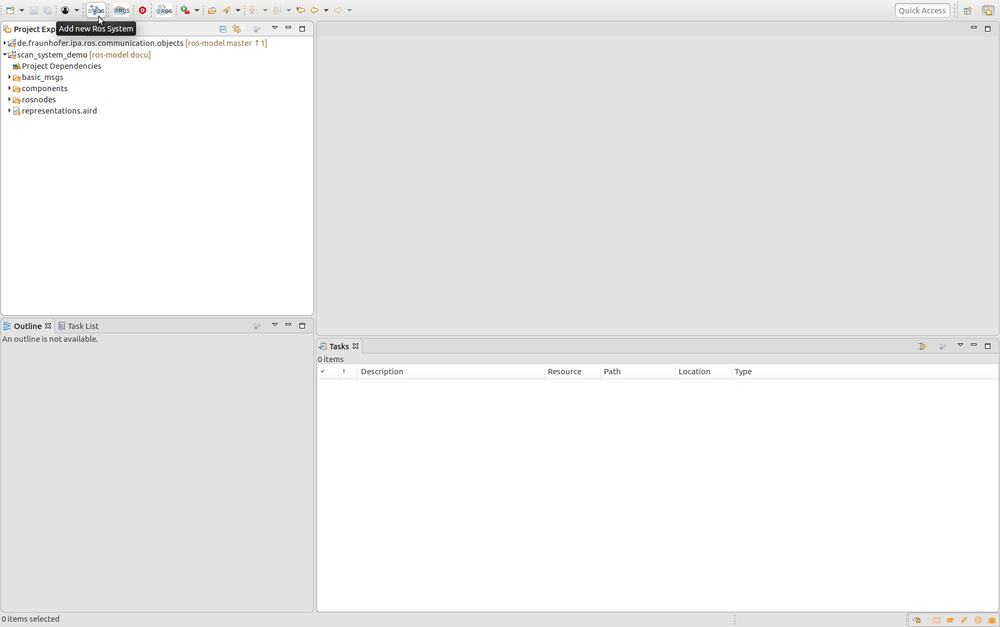
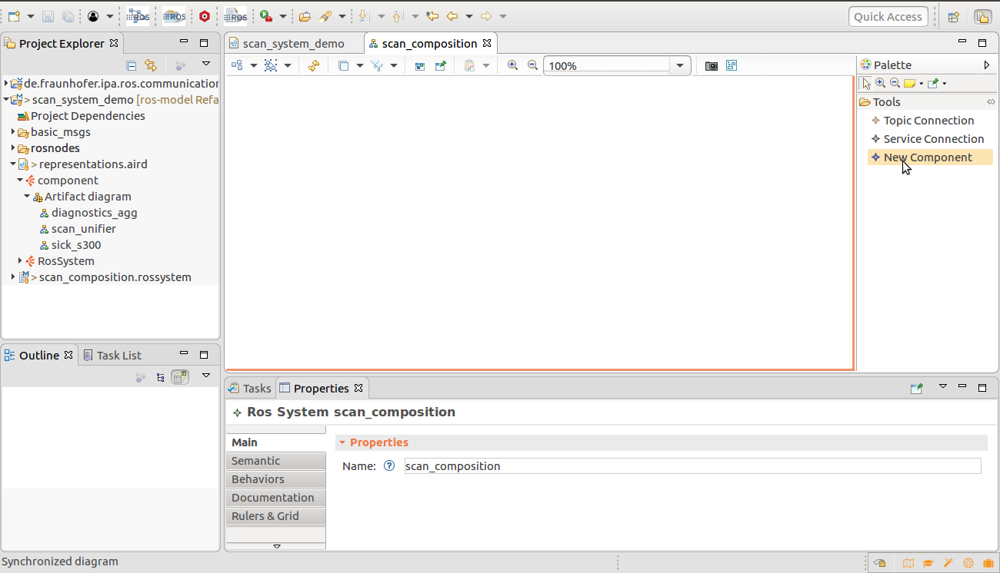
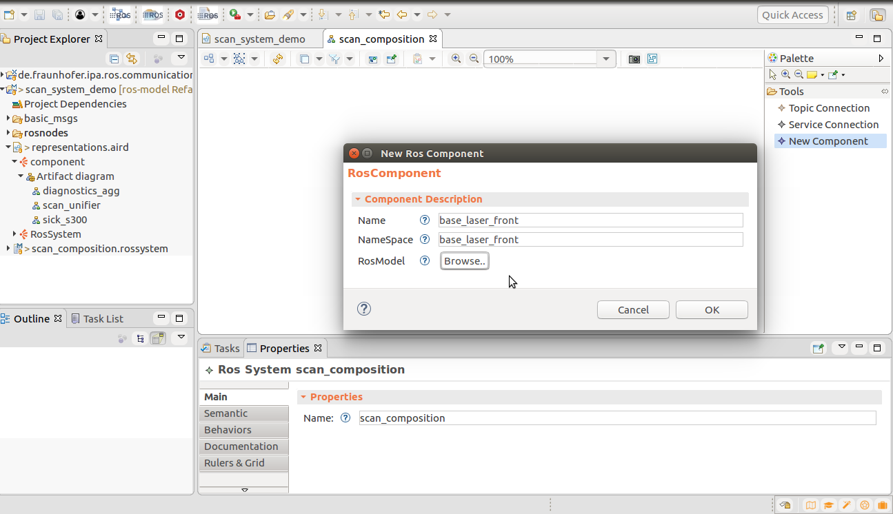
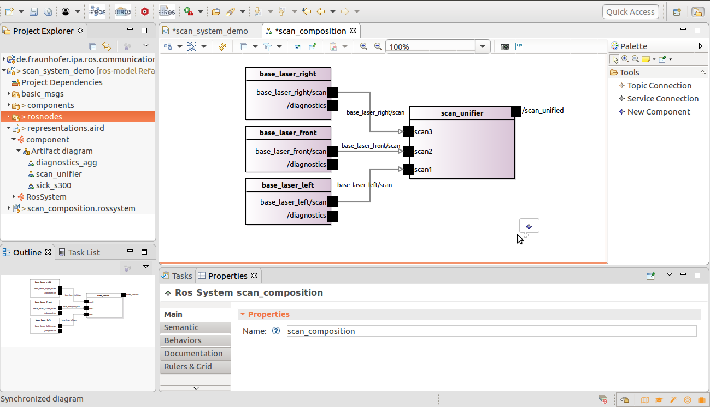
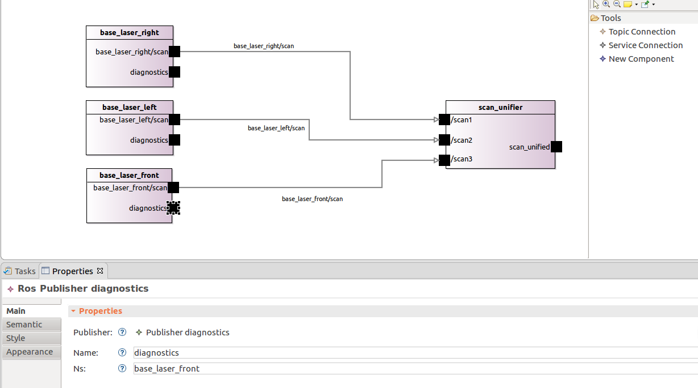
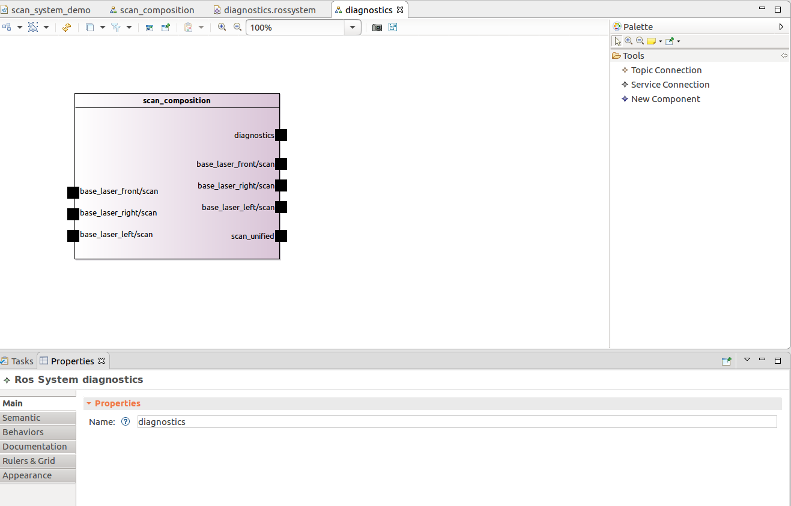
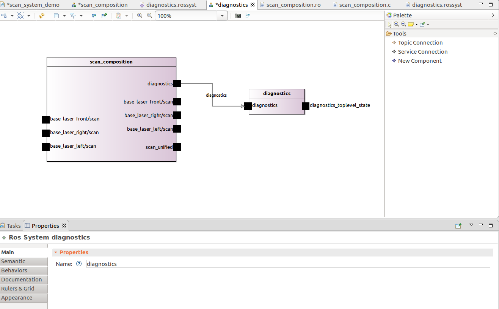

## Create a new Rossystem composing existing components

Please be sure that the tool is installed and your workspace setup, see the [installation guide](../README.md) for further details.

Import the example project scan_system_demo (under the "examples" folder of this repository) to the workbench of your application:

```
scan_system_demo
```

To create a new system you have to press the button "Add new Ros System"



A dialog will be open and ask you to select a folder to contain your new model, you can just select the "scan_system_demo" folder. Give a name to your new system and press "Next > ", the new dialog window will ask you for a Ros Components, this step is not required, you can just press "Finish".

To modify easily the model you can use a Sirius representation. Open the file representation.aird with the Aird editor and in the menu representations choose the "RosSystem" option and press "New.." then choose the Ros System entity of your "*.rossystem" model and press finish.

A new window will appear where you can choose and add elements by selecting them on the side toolbar and the properties view. With the toolbar you can add a new component. Press the option "New component", a window will be openned and ask for a new name for you component:



Give a name and (optionally) a namespace to a new component, for example:



Press the button "Browse.." and select the model "sick_s300.ros" of the rosnode folder. Repeat the previous process for the creation of other tree components:

```
Name: base_laser_left
NameSpace: base_laser_left
RosModel: rosnodes/sick_s300.ros
```

```
Name: base_laser_right
NameSpace: base_laser_right
RosModel: rosnodes/sick_s300.ros
```

```
Name: scan_unifier
NameSpace: 
RosModel: rosnodes/scan_unifier.ros
```

Now that the components are created you can define the desired connections between the components using the tool "Topic Connection", the only imposed rule to create connections is that the information object (message or service type) is the same on both sides. For our exmaple the natural connection to be created are the shown on the following figure:



If the modifications are correct and after save the changes, two files will be automatically generated 1) a componentinterface file of your full system in the folder "components" and 2) a launch file to start the selected ROS nodes in the correct predefined Namespace (in a new folder "src-gen").

The resulted launch file contains the defined namespaces and remap the topics of the scan_unifier node, looking like:

```
<?xml version="1.0"?>
<launch>

	<node pkg="cob_sick_s300" type="cob_sick_s300" name="base_laser_front" ns="base_laser_front" cwd="node" respawn="false" output="screen">
	</node>
	<node pkg="cob_sick_s300" type="cob_sick_s300" name="base_laser_right" ns="base_laser_right" cwd="node" respawn="false" output="screen">
	</node>
	<node pkg="cob_sick_s300" type="cob_sick_s300" name="base_laser_left" ns="base_laser_left" cwd="node" respawn="false" output="screen">
	</node>
	<node pkg="cob_scan_unifier" type="scan_unifier_node" name="scan_unifier" cwd="node" respawn="false" output="screen">
		<remap from="scan3" to="base_laser_front/scan" />
		<remap from="scan1" to="base_laser_right/scan" />
		<remap from="scan2" to="base_laser_left/scan" />
	</node>

</launch>
```

We can also try removing the namespace of the diagnostics topics for the scanners. Choose the different diagnostics publisher and modify using the properties view its names to for example:



These changes should change the roslaunch file to:

```
<?xml version="1.0"?>
<launch>

	<remap from="base_laser_front/diagnostics" to="diagnostics" />
	<remap from="base_laser_right/diagnostics" to="diagnostics" />
	<remap from="base_laser_left/diagnostics" to="diagnostics" />

	<node pkg="cob_sick_s300" type="cob_sick_s300" name="base_laser_front" ns="base_laser_front" cwd="node" respawn="false" output="screen">
	</node>
	<node pkg="cob_sick_s300" type="cob_sick_s300" name="base_laser_right" ns="base_laser_right" cwd="node" respawn="false" output="screen">
	</node>
	<node pkg="cob_sick_s300" type="cob_sick_s300" name="base_laser_left" ns="base_laser_left" cwd="node" respawn="false" output="screen">
	</node>
	<node pkg="cob_scan_unifier" type="scan_unifier_node" name="scan_unifier" cwd="node" respawn="false" output="screen">
		<remap from="scan3" to="base_laser_front/scan" />
		<remap from="scan1" to="base_laser_right/scan" />
		<remap from="scan2" to="base_laser_left/scan" />
	</node>

</launch>
```

The next part of this tutorial shows the creation of a new System by the composition of sub-systems.

To create a new system you have to press the button "Add new Ros System" and a dialog will be open and ask you to select a folder to contain your new model, you can just select the "scan_system_demo" folder. Give a name to your new system and press "Next > ", the new dialog window will ask you for a Ros Components press "Browse.." and select the componentinterface autogenerated by the previous example (i.e. scan_system_demo/components/scan_composition.componentinterface).

To modify easily the model you can use a Sirius representation. Open the file representation.aird with the Aird editor and in the menu representations choose the "RosSystem" option and press "New.." then choose the Ros System entity of your "*.rossystem" model and press finish.

A new window will appear where you can choose and add elements by selecting them on the side toolbar and the properties view. 



The new system already contains the previous system model as a single block and can be composed by adding new components, for example you can create a new component with the following configuration:

```
Name: diagnostics
NameSpace: 
RosModel: rosnodes/diagnostic_aggregator.ros
```
And join the diagnostics interfaces with a connection. The resulted launch file will include the previous generated launch file and the new imported node.



```
<?xml version="1.0"?>
<launch>

...

</launch>
```

It is recommended to continue with: [Introspection at design-time](simulateRuntime.md)
