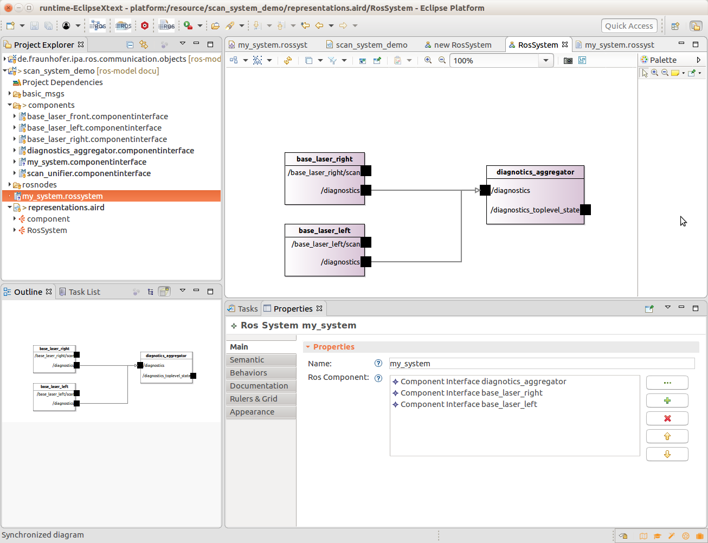

## Create a new Rossystem composing existing components

Please be sure that the tool is installed and your workspace setup, see the [installation guide](../README.md) for further details.

Import the example project scan_system_demo (under the "examples" folder of this repository) to the workbench of your application:

```
scan_system_demo
```

To create a new system you have to press the button "Add new Ros System"


A dialog will be open and ask you to select a folder to contain your new model, you can just select the "scan_system_demo" folder, pressing he button next the new page will ask for Ros components as input of your system. 

In the folder "components" of the project "scan_system_demo" you can find some example, pick for example de following components:
```
base_laser_right.componentinterface
base_laser_left.componentinterface
diagnostics_aggregator.componentinterface
```

To modify easily the model you can use a Sirius representation. Open the file representation.aird with the Aird editor and in the menu representations choose the "RosSystem" option and press "New.." then choose the Ros System entity of your "*.rossystem" model and press finish.

A new window will appear where you can choose and add elements by selecting them on the side toolbar and the properties view.



If the modifications are correct and after save the changes, two files will be automatically generated 1) a componentinterface file of your full system in the folder "components" and 2) a launch file to start the selected ROS nodes in the correct predefined Namespace (in a new folder "src-gen").

tbd: Conections

