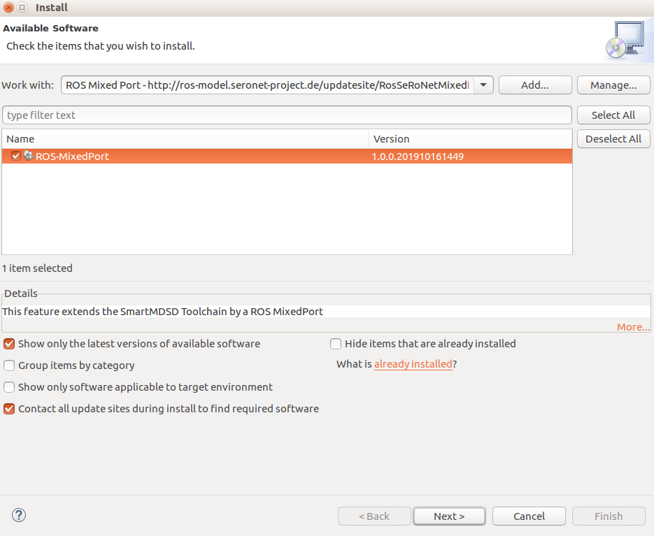
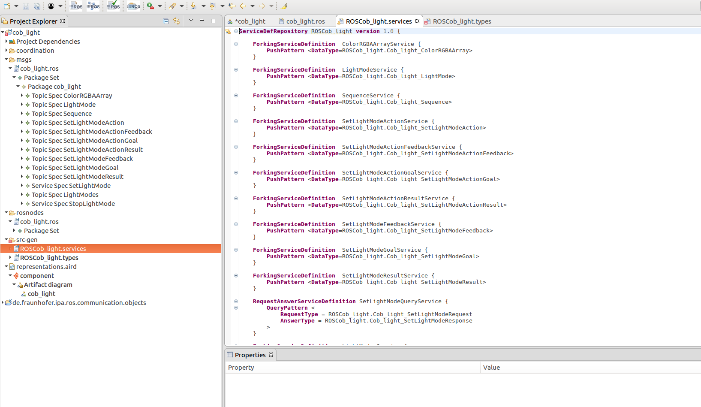

## Connect ROS tooling models with SeRoNet

### Install SeRoNet Toolchain

Download the Release Version: [SeRoNet toolchain release](https://web2.servicerobotik-ulm.de/files/SeRoNet_Tooling/1.0/SeRoNet-Tooling-v1.0.tar.gz)

```
tar xzvf SeRoNet-Tooling-v1.0.tar.gz
SeRoNet-Tooling-v1.0/eclipse
```

Add the ROS Mixed Port plugins to the release. In Eclipse, go to *Help* > *Install New Software...*. To install the latest version of the ROS tooling, add the update site URL [http://ros-model.seronet-project.de/updatesite/RosSeRoNetMixedPort/latest/](http://ros-model.seronet-project.de/updatesite/RosSeRoNetMixedPort/latest/) in the *Work with* section. If you wish to install an earlier version instead, go to the [the update site](http://ros-model.seronet-project.de/updatesite/RosSeRoNetMixedPort), choose the desired version and copy its URL.



The category *ROS-MixedPort* appears in the *Name* area. Check the box in front of *ROS-MixedPort* and click *Next* to review the list of items to be installed. Click *Next* again to read and accept the terms of the license agreements and afterwards click *Finish*. Eclipse will then start to install the ROS-SeRoNet Mixed Port plugin and its dependencies. If you get a security warning about the authenticity, click OK. Finally, when asked, restart Eclipse to complete the installation process.

### Import the ROS project that contains the node or the system to be connected to SeRoNet

The previously installed toolchain contains the ROS tooling modules required to interpret the ROS models gramatic. You can change to the ROS perspective by:

Go to Menu Window -> Perspective -> Open Perspective -> Other... -> ROS developer. Your application toolbar will be automatically configured.

Before you bring your package you have to import the project located under the "ROSCommonObjects" folder of this repository to the workbench of your application:
```
de.fraunhofer.ipa.ros.communication.objects
```

And you can import now the project to be transformed, for example [cob_light](https://github.com/ipa-nhg/ros-model-examples/tree/master/RosComponents/cob_light). By openning the representation file you can see the following model visualization:


### Transform the required communication objects

For the case of the cob_light driver, it contains the definition of its communication interfaces (i.e. for ROS: msgs and srvs). First we have to transform these objects to a the SeRoNet standard format, there is a tool that automate this process. The user can very easily trigger it by a right clicking on the ROS model file (cob_light/msgs/cob_light.ros) and selecting the option "Generate SeRoNet communication objects".

This will generate the file services and the file types under the folder *src-gen*.




