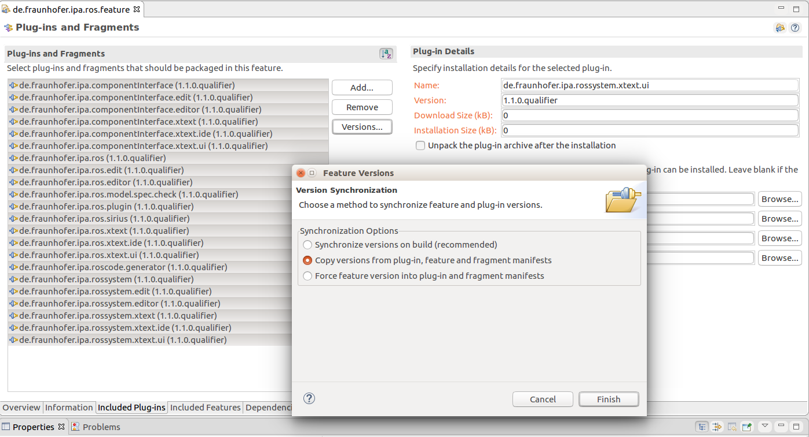

# Update Release versions (only for administrators)

### 1. Update version

Run the command:

```
mvn versions:set -DnewVersion=X.Y.Z-SNAPSHOT -f plugins/de.fraunhofer.ipa.ros.parent/pom.xml
```

This will upgrade the *pom.xml* and *MANIFEST.MF* of all the repositories.

### 2. Synchronize the ROS fetuare

Open in eclipse the file *de.fraunhofer.ipa.ros.feature/feature.xml* and under *Overview* press the button *Synchronize* and choose the second option *Copy versions from plug-in, feature and fragment manifest*




Push to this GitHub repository the status

### 3. Export the updated feature

From the menu *File* select *Export* and choose the option *Deployable features* from *Plug-in Development* category. Select the *de.fraunhofer.ipa.ros.feature* Feature and give a path for destination (e.g. ~/Desktop/export)

The resulted folders and files have to be copied to the *updatesite/latest* folder fo the [Update Site server](http://ros-model.seronet-project.de/updatesite/latest/) and the [site.xml](http://ros-model.seronet-project.de/updatesite/latest/site.xml) file updated to point the new version.

### 4. Add a new release on GitHub

Tag the current point of the history with the release number previously given (X.Y.0). Optionally upgrade the [exported files](#3-export-the-updated-feature) as a zip.

# Create a new .jar file as release

In the folder *plugins/de.fraunhofer.ipa.ros.parent* execute the command:
```
mvn package
```

The generated .jar file will be automatically generated under *plugins/de.fraunhofer.ipa.ros.plugin/target/de.fraunhofer.ipa.ros.plugin-X.Y.Z-SNAPSHOT.jar*.
