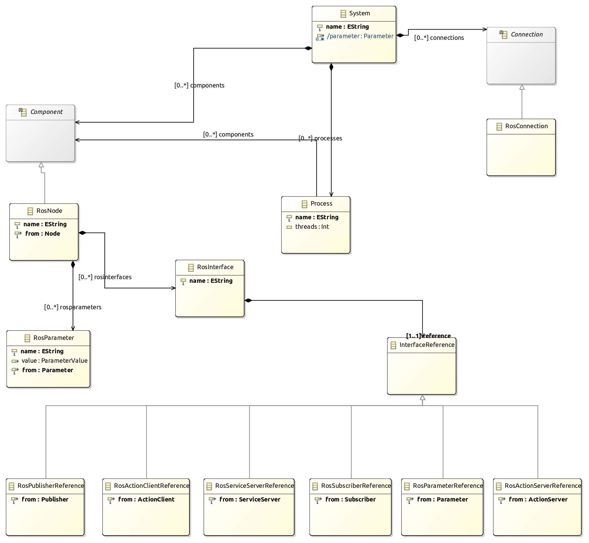

# HOW TO DESCRIBE ROS SYSTEMS USING THE LANGUAGE

In our case we consider a system to be a combination of nodes running at the same time. Basically we use the typical component-based system concept, where each ROS node could be considered a component. Therefore the .rossystem file allows to describe a series of nodes and the connections that are created between them using topics, services or actions. It also allows to give values to the parameters.

The structure of the system description is as shown in the following diagram:




The format of a system is as follows:
```
my_awesome_system:
  processes:
    process1:
      nodes: [ node1 , node2 ]
      threads: 2
  nodes:
    node1:
      from: "my_awesome_pkg.awesome_node_provider" #From .ros2 file
      interfaces:
        - awesome_pub: pub-> "awesome::awesome_pub" # From .ros2 file
      parameters:
        - ParamName: "awesome::awesome_param"
         value: "Label"
    node2:
      from: "my_awesome_pkg.awesome_node_consumer" #From .ros2 file
      interfaces:
        - awesome_sub: sub-> "awesome::awesome_sub"
  connections:
    -[awesome_pub, awesome_sub] # From line 10 and 17
```

Below we analyze each part that makes up the system and how it is formed:

- (Optional) Processes: describes all system processes. Each process is determined by a name (process1 in the example), a set of nodes given as a list and the number of threads. The nodes must be defined within the system nodes (in the example they are lines 7 and 14).

- Nodes: describes all nodes in the system. Nodes are described as a reference to an existing package (and described in a .ros2 file) and has the following attributes:
  - name: A name which must be unique in the file (in the example node1).
  - from: reference to the instantiated node description. It is given by the name of the package that contains it and the name of the original node.
  - interfaces: list of all the interfaces of the node. Here it is not mandatory to list of the interfaces (again) as they are already on the .ros2 file. Only the renamed interfaces must be added, as well as, interfaces that will form a connection with other components. A referenced interface is given by: **NewName: Type -> ref_artifact_name::ref_interface_name** where `ref_artifact_name` and `ref_artifact_name` come from the ros2 file. And the Type can be pub, sub, sc, ss, ac, or as.
  - parameters: it is used to pass a value to a parameter. Every parameter shall have a name (my_param) in the example, and the reference to an existing parameter, given by 'artifact_name::param_name' frpm a .ros2 file. Then under value, a new value can be given to the parameter.
  
- (Optional) Connections: describe the connections between the nodes. They are given by `[name_of_the_output, name_of_the_input]` the outputs and inputs musst be previously created, they musst have the same communication pattern (topic, service or action) and the same type of communication object (for example std_msgs/String). Otherwise, the validator will give an error.

The Editor of the models contains validators and the auto-complete function, which can be called with the combination of the keys `Ctrl` and space bar.
