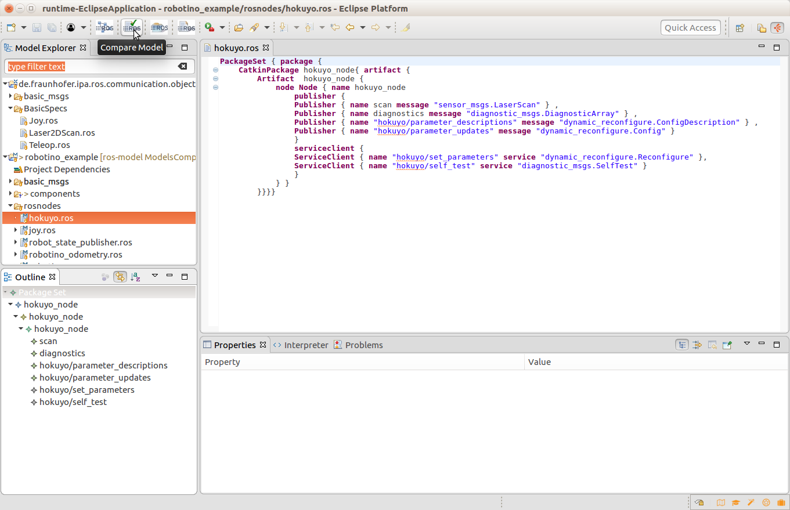
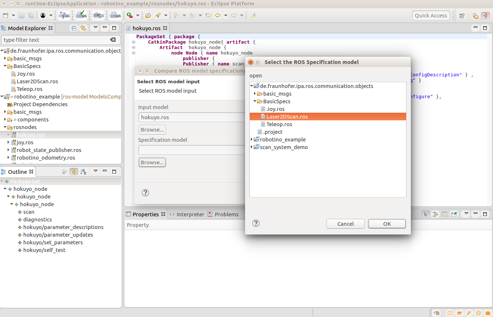
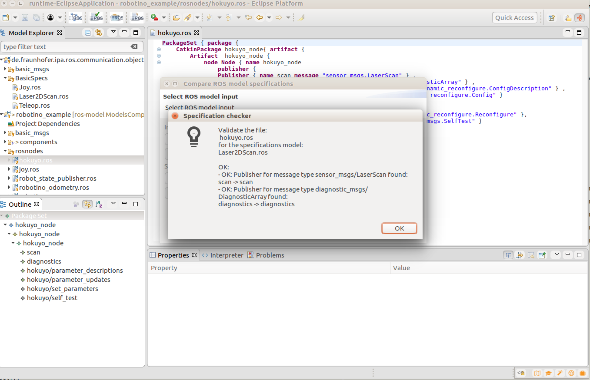

## Compare your model with a Specification

If you want to check that the model of your node is following a concrete specification of a driver, you can use our tool.

Press the button of ROS model checker:

Select as input your model file and as specification the model that defines the standard you want to follow (some specifications are available under **de.fraunhofer.ipa.ros.communication.objects/BasicSpecs**).

To use this feature you have to locate your model file in your eclipse workspace by importing the project that contains it.

By pressing *Finish* a dialog will give you a summary of your analysis:

