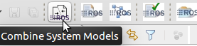
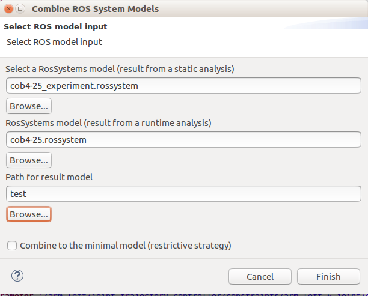

# MODEL COMBINATION


This feature allows the merge of two different ROS system models.   To combine two system models you have to press the button "Combine System Models"




A pop-up menu will ask you for the two models to combine (have to be on imported project of your workspace) and the path where to save the resulted file (that will be called *result.rossystem*. Finally the user can check the box "Combine to the minimal model (restrictive strategy)"  to switch the strategy.




To cover as many use cases as possible we defined 2 different strategies for the models combination:

- Get from both models all the components and interfaces. In case a duplicated component is found our tool merge all the interfaces for the component in a single one.
- Get all the components from the first given model and complete for its components the interfaces with the ones found on the second given model (that we call minimal model or restrictive strategy).

The idea if the first strategy is to sum components and interfaces into a single system file. The purpose of the second strategy is to filter, based on a specification model, the interfaces of a big system. Let see an example: image I call the [ros_graph_parser](https://github.com/ipa-led/ros_graph_parser) to get information of a large robot system like a [Care-O-bot4](http://wiki.ros.org/Robots/cob4),  the obtained system file contains in total 85 components and almost 600 interfaces (topics, services and actions), you can see [here](https://github.com/ipa-nhg/ros-model-experiments/blob/cob4/cob4-25/cob4-25_runtime/cob4-25.rossystem) the full model. Some of these components are specific for the specific Care-O-bot version where I executed the extractor and I want just a model as overview of generic components and critical components, like the following one (written manually):

```
RosSystem { Name 'cob4-25'
    RosComponents (
        ComponentInterface { name '/base_laser_front/driver'},
        ComponentInterface { name '/torso_cam3d_down/realsense2_camera'},
        ComponentInterface { name '/arm_right/driver'},
        ComponentInterface { name '/torso_cam3d_right/realsense2_camera'},
        ComponentInterface { name '/torso/driver'},
        ComponentInterface { name '/robot_state_publisher'},
        ComponentInterface { name '/torso_cam3d_left/realsense2_camera'},
        ComponentInterface { name '/arm_left/driver'},
        ComponentInterface { name '/base_laser_left/driver'},
        ComponentInterface { name '/base_laser_right/driver'},
        ComponentInterface { name '/sensorring/driver'},
        ComponentInterface { name '/sensorring_cam3d/realsense2_camera'},
        ComponentInterface { name '/base/driver'},
        ComponentInterface { name '/head_cam'}
)}
```

If I combine this model with the runtime one I get as result a new system with only the components I listed previously but filled with the interfaces that the execution of their nodes offer at runtime. See the result [here](https://raw.githubusercontent.com/ipa-nhg/ros-model-experiments/cob4/cob4-25/cob4-25_monitoring/cob4-25_desired_combined.rossystem) .

Other use of this feature is the composition of system files got from the auto models extractors that we offer  ([static analysis](https://github.com/ipa320/ros-model/blob/master/docu/NewRosModel.md) and [runtime introspection](https://github.com/ipa-led/ros_graph_parser)).

While the static analyzer of code extracts all the information for each node, the amount of extracted data is quite limited. Conversely, the runtime introspection can't find some static information of the nodes (like the ROS package that contains it and the dependencies) but this method is able to find almost all the interfaces running on the system. With the model combination and using the static analysis extraction as  the first model to combine , you can make a good use of the benefits of both methods results.
