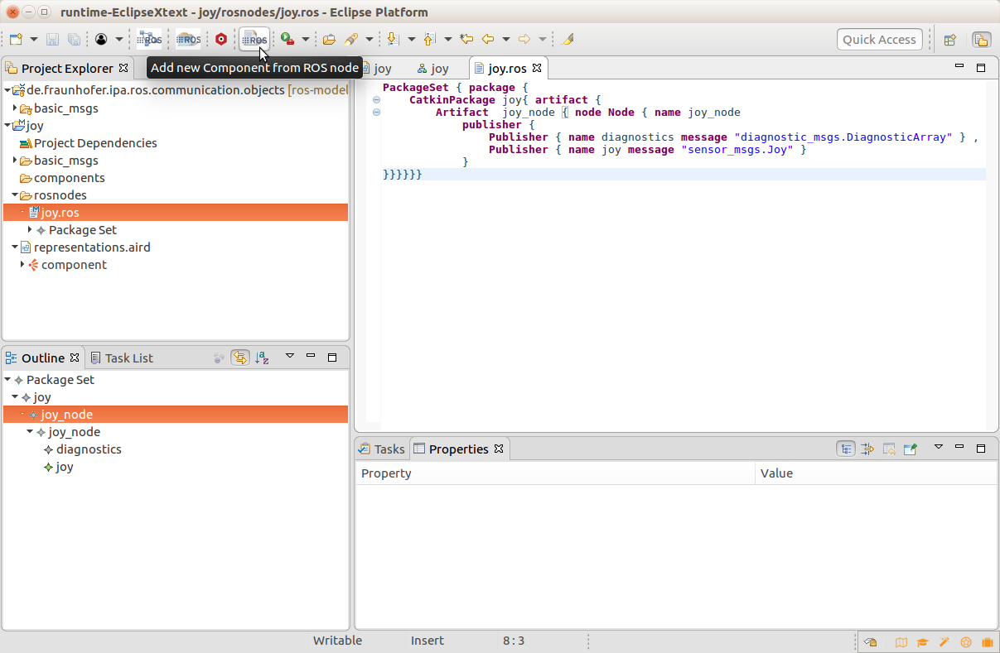
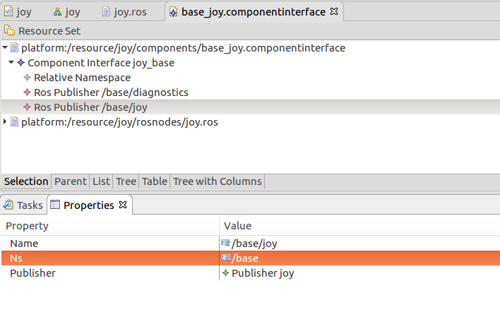

## Create a component from a node

Please be sure that the tool is installed and your workspace setup, see the [installation guide](../README.md) for further details.

To create a new component you have to press the button "Add new Component from Ros node"

A dialog will be open and ask you to select a folder to contain your new model (we recommend the "components" one) and to give a name to your component.

The next menu will ask you to give to your component a name and a namespace (optional). The last information needed is the Ros node model related to your component to be references (.ros file).

Your component will be automatically created, in case you want to modify the default remaps of the interfaces you can edit the file using the EMF editor

