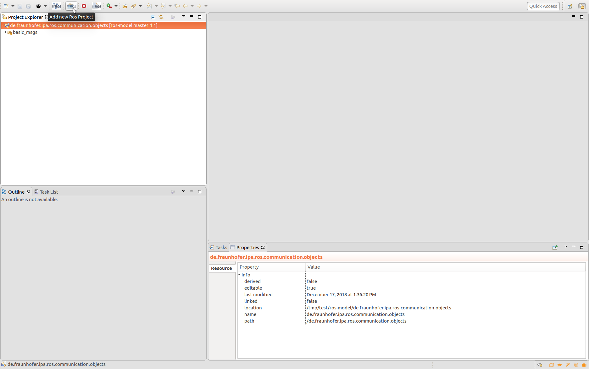
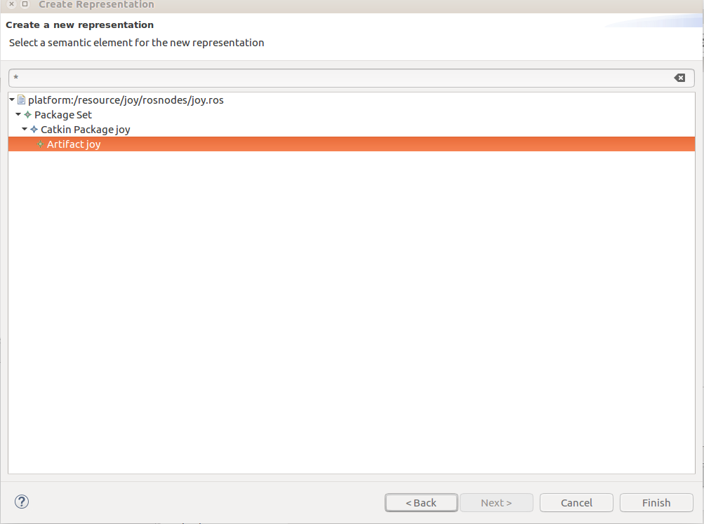
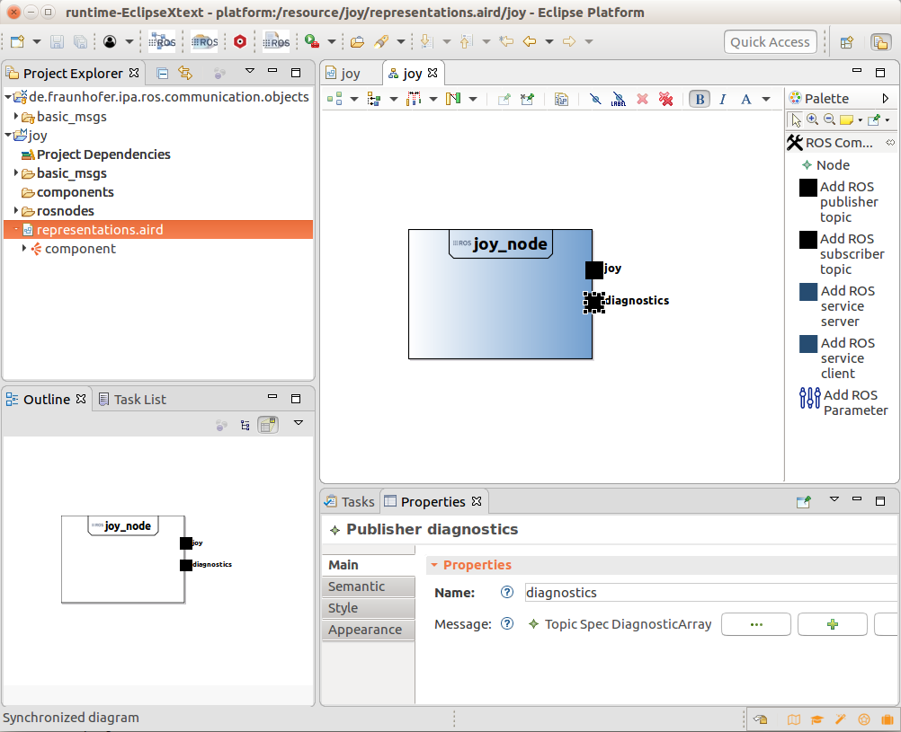

## Create a new ROS project and describe a node

Please be sure that the tool is installed and your workspace setup, see the [installation guide](../README.md) for further details.

To create a new project you have to press the button "Add new Ros Project"

A pop-up dialog will ask you to define the name of the project. Once you press finish a new folder will be created with a collection of common messages and services and a predefined ROS model. To describe easily the model you can use a Sirius representation.
<!--Open the file representation.aird and in the menu representations choose the "Artifact diagram" option and press "New.." then choose the artifact entity of your "*.ros" model and press finish.

-->

A new window will be opened where you can choose and add elements by selecting them on the side toolbar. Using the properties view you can modify and describe the properties of each element.

Once you finish you can open the file under the folder "rosnodes" that describes your model and check that all the information is correct. This editor has an autocomplete function (by pressing Ctrl+Space) and will report any error made by editing.
