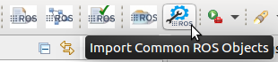
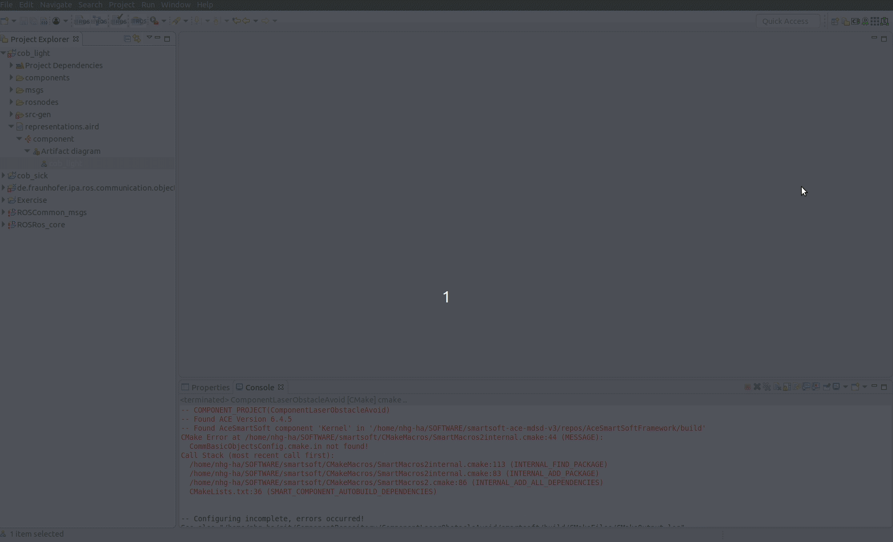
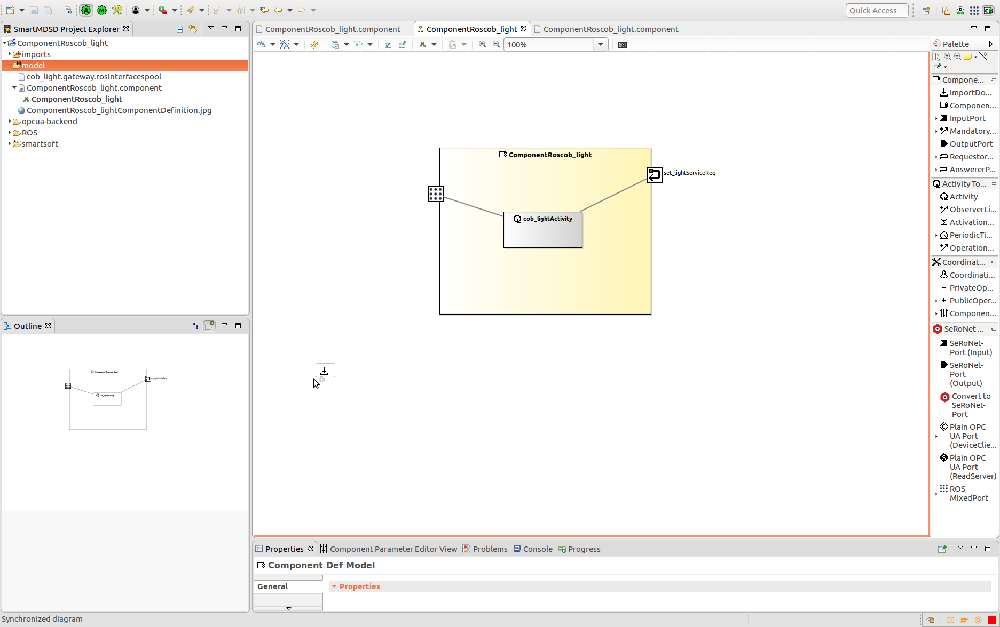
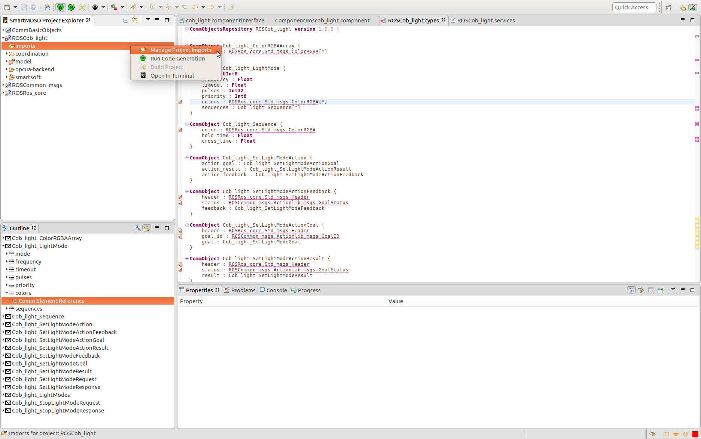

## Connect ROS tooling models with SeRoNet

### Prerequisites

Create a git folder and clone the following repositories:

```
git clone https://github.com/ipa-nhg/ros-model-examples && \
git clone https://github.com/seronet-project/SeRoNet-examples && \
git clone https://github.com/Servicerobotics-Ulm/DomainModelsRepositories
```
### Install SeRoNet Toolchain

Download the Release Version: [SeRoNet toolchain release](https://web2.servicerobotik-ulm.de/files/SeRoNet_Tooling/1.1/SeRoNet-Tooling-v1.1.tar.gz)

```
tar xzvf SeRoNet-Tooling-v1.1.tar.gz
SeRoNet-Tooling-v1.1/eclipse
```

The last command will open the toolchain, select a folder for your Workspace and switch to the Workbench view. We recommend to check the latest version of the software using the Help menu -> Check for updates.

### Import the ROS project that contains the node or the system to be connected to SeRoNet

The previously installed toolchain contains the ROS tooling modules required to interpret the ROS models gramatic. You can change to the ROS perspective by:

Go to Menu Window -> Perspective -> Open Perspective -> Other... -> ROS developer. Your application toolbar will be automatically configured.

This example requires the common ROS interfaces, by clicking the button *Import Common ROS Objects* you will get the latest version from GitHub and import them automatically to your workspace, this function button is only available for the ROS developer perspective: menu *Window* => *Perspective* => *Open Perspective* => *ROS developer*.



And you can import now the project to be transformed, for example [cob_light](https://github.com/ipa-nhg/ros-model-examples/tree/master/RosComponents/cob_light) from the ros-model-examples repository (previously cloned).


By openning the representation file you can see the following model visualization:


Or you can create a [new project from an empty model](https://github.com/ipa320/ros-model/blob/master/docu/NewProject.md). In case you have an existing ROS package that contains the C++ code of your component we recommend to use the [extractor](https://github.com/ipa320/ros-model/blob/master/docu/NewRosModel.md) instead of start from scratch the model definition.

NOTE: all the msgs, srvs or actions used by your node (package dependencies) have to be also described, we made available a model of the most [common ROS interfaces](https://github.com/ipa320/ros-model/tree/master/ROSCommonObjects/de.fraunhofer.ipa.ros.communication.objects/basic_msgs). In case one of your package dependencies is not included in this list you have to create the models usin the following [script](https://github.com/ipa320/ros-model/blob/master/docu/NewCommunicationObjects.md)

### Transform the ROS component model (from a node or a system) to a SeRoNet component model

By default the tooling will automatically autogenerate the corresponding component interface (a generic model of a component) of all the nodes on your ROS project. The autogenerated components are always located under a new folder called *components/*. This model is the bridge from ROS to other frameworks. For the case of SeRoNet the tooling includes a special function that can be activated by a right click on the file an choosing the option *Generate ROS-SeRoNet Mixed Port*.


The result of this call is a rospoolinterface file. Start point of the following tutorial: https://wiki.servicerobotik-ulm.de/tutorials:ros:mixed-port-component-ros.

Complementarily and to make easier the relay of interfaces we incorporated an extra help function that automatically relays one of the ROS interfaces. The previous function through its pop-up dialog guides the user to generates not only the rospoolinterface model but also a suggestion of a SeRoNet component with a ROS mixed Port. The resulted files will be generated under the folder *src-gen/SeRoNetComponent*


These two files can be used to create a [new SeRoNet component](https://wiki.servicerobotik-ulm.de/tutorials:develop-your-first-component:start). First the presperctive have to be changed to the "Component Supplier" one. This perspective will add the option to create a new Component Project by giving a name and a localization. The previosly generated SeRoNetComponent files can simply be copied to the model folder of the new project.



For this example the corresponding SeRoNet component with a ROS Mixed Port (by creating a [new SeRoNet component](https://wiki.servicerobotik-ulm.de/tutorials:develop-your-first-component:start) and including the autogenerated files) will shows:




For further information please check: [Automatic transformation of ROS Components to SeRoNet mixed Ports](https://github.com/seronet-project/SeRoNet-Tooling-ROS-Mixed-Port/tree/master/de.seronet_projekt.ros.componentGateway.generator#automatic-transformation-of-ros-components-to-seronet-mixed-ports)

### Transform the required communication objects

For some cases like the cob_light driver, the ROS node definition requires some non-common ROS msgs or services. To be able to interoperate with non-ROS frameworks we have to transform this communication objects to the SeRoNet standard format. There is a tool that automate this process. The user can very easily trigger it by a right clicking on the ROS model file (cob_light/msgs/cob_light.ros) and selecting the option "Generate SeRoNet communication objects".

This will generate the file services and the file types under the folder *src-gen*.


For further information please see: https://github.com/ipa-nhg/SeRoNet-Tooling-ROS-Mixed-Port/tree/M2MCommunicationObjectsReadme/de.seronet_projekt.ros.componentGateway.generator#automatic-transformation-of-communication-objects

These files are the input for a SeRoNet Domain Model. By creating a [new Domain Project](https://wiki.servicerobotik-ulm.de/tutorials:develop-your-first-domain-model:start) you can just copy these two files and the models will be automatically added to the interpreter.

Probably after create the new Domain Models project and add the types and services files you will get an error because some dependencies are missed.


For the most common ROS objects the project dependencies are already available. We suggest to import *always* by default the following projects from the GitHub repositories previously cloned:

- DomainModelsRepositories/CommBasicObjects
- SeRoNet_Release_test/git/SeRoNet-examples/SeRoNet-Tooling-ROS-Mixed-Port/DomainRosModelsRepositories/ROSRos_core
- SeRoNet_Release_test/git/SeRoNet-examples/SeRoNet-Tooling-ROS-Mixed-Port/DomainRosModelsRepositories/ROSCommon_msgs

Then open the Domain Expert perspective (Go to Menu Window -> Perspective -> Open Perspective -> Other... -> Domain Expert) and for the created Domain Models expert that holds your communcaition object add the import dependencies (Right click on *imports* folder).


