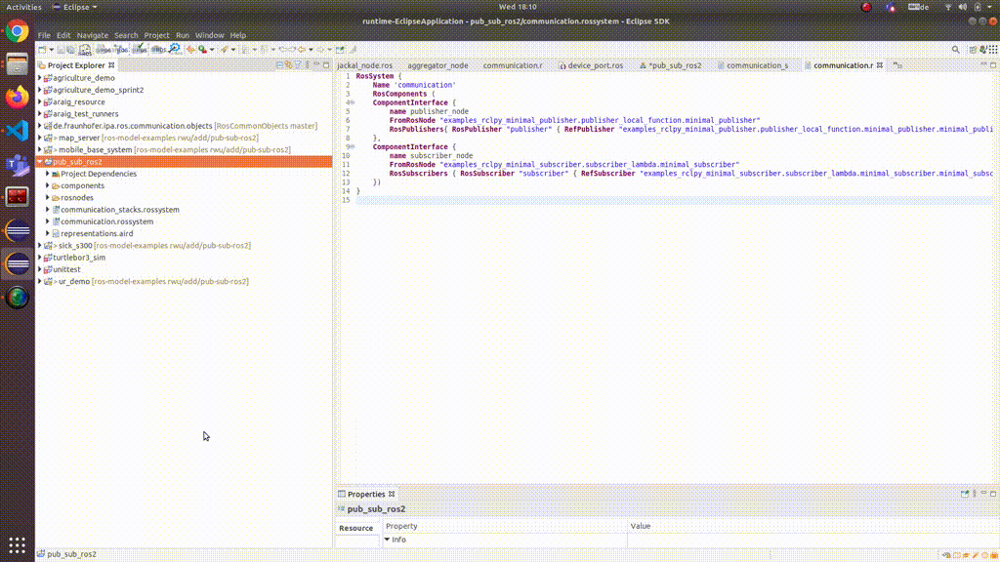
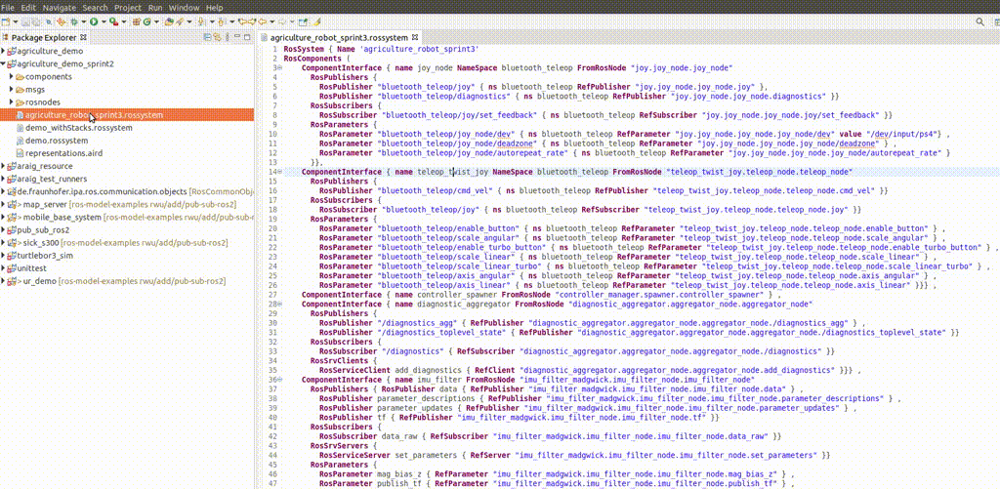

## How to get deployment artifacts


### Preparation

Please be sure that the tool is installed and your workspace setup, see the [installation guide](../README.md) for further details.

Import the example project pub_sub_ros2 (from the [ros-model-examples](https://github.com/ipa-nhg/ros-model-examples) repository) to the workbench of your application:

```
pub_sub_ros2
```

Import the example project agriculture_demo_sprint2 (from the [ros-model-examples](https://github.com/ipa-nhg/ros-model-examples) repository) to the workbench of your application:

```
agriculture_demo_sprint2
```

Install docker and docker-compose

### Get get deployment artifacts

To create deployment artifacts you need to right click "*.rossystem" file.

#### Rossystem without parameters
In this case, you need to right click "communication.rossystem". Then you need to choose "Deployment Artifacts Generator".

A dialog will be open and ask you to select a ROS Distro. In this case, the rossystem doesn't contain parameters, so you only need to choose a ROS Distro.

This process is as shown blow.



Then deployment artifacts will automatically created, as you can find under "src-gen" folder


#### Rossystem with parameters

In some case, you need to choose device ports based on parameters defined in a rossystem.

For example, if you want to run teleop with a joystick in a docker container, docker need to know which port is the joystick connect to.

In this case, you need to right click "communication.rossystem". Then you need to choose "Deployment Artifacts Generator".

A dialog will be open and ask you to select a ROS Distro. In this case, the rossystem contains parameters, you need to choose the corresponding parameter to the joystick port value.

This process is as shown blow.



Then deployment artifacts will automatically created.


### Use github action to generate docker images

Once you get deployment artifacts, you can use git action to build and release docker images automatically.

If you already have a repository in github, you can use it. If not, you need to create a repository. For example, we use ("rossystem-deployment" repository)[https://github.com/ipa-rwu/rossystem-deployment.

You also need a dockerhub account. Once you have dockerhub account, you need to add your Docker ID as a secret to GitHub.
1. Add your Docker ID as a secret to GitHub. Navigate to your GitHub repository and click Settings > Secrets > New secret.
2. Create DOCKER_USERNAME and DOCKER_PASSWORD

The result should looks like below.


In this repository, you need to create a folder ".github/workflows". Then you need to put a file with suffix "_workflow.yml" from a generated folder to this folder. For example, you can put "communication_foxy_workflow.yml" or "agriculture_robot_sprint3_noetic_workflow.yml" under ".github/workflows" folder, as shown below.


Then you need to put the generated folder in this repository. For example, we put "communication_ros2" and "agriculture_robot_sprint3" in the repository. The locations of these two folder as shown below.


You can push them to github. Github action will build docker image and push images in dockerhub.

### Start the system

Before starting the system, you need to modify "docker-compose" file. You need to add your docker account as prefix before a docker image name.
For example, we add "kogrob2" (docker hub account name) in front of "communication_foxy:latest", as shown below.


Then you can use the command below to start the system.
```
docker-compose up
```
