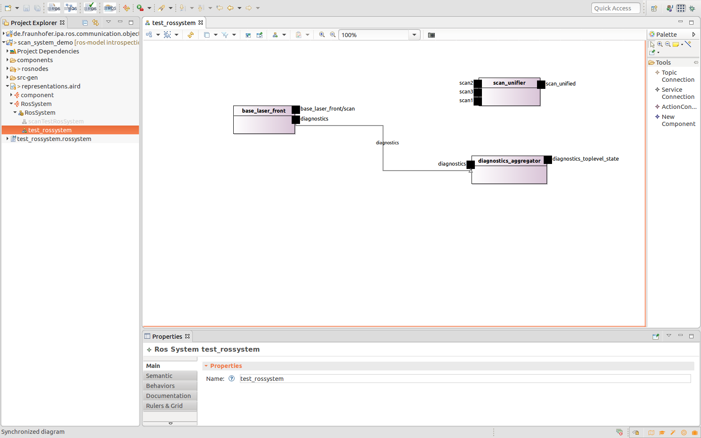
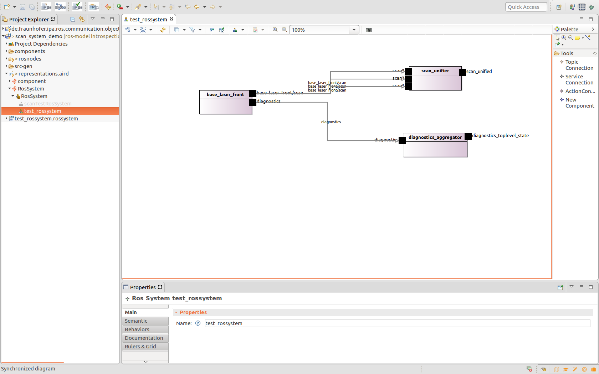

# Introspection at design time

In ROS, when executing a launch file that defines several nodes, the connections will be automatically created by the rosmaster. To "simulate" this behaviour, the tooling infrastructure offers a button that creates the connections that will be wired automatically at runtime, that means: all interfaces with the same name and the same message (communication object) type.

This function can be called from the system graphical editor. The definition of ROS systems is covered in this tutorial: [Define a ROS system as a composition of components](NewSystem.md).

The menu can be opened by right-clicking on the system background. It offers 3 options:

* Simulate Runtime connections: this option will create all connections that are automatically built at runtime (interfaces with same name and same message (communication object) type). In the example diagram these are the "diagnostics" topics:

* Auto Connect open ports: this option will suggest likely connections, i.e. it will join interfaces with the same message (communication object) type and will remap consequently the names of the ports. For the example diagram the result will be:

* Remove all connections: to clear the connections of the model
