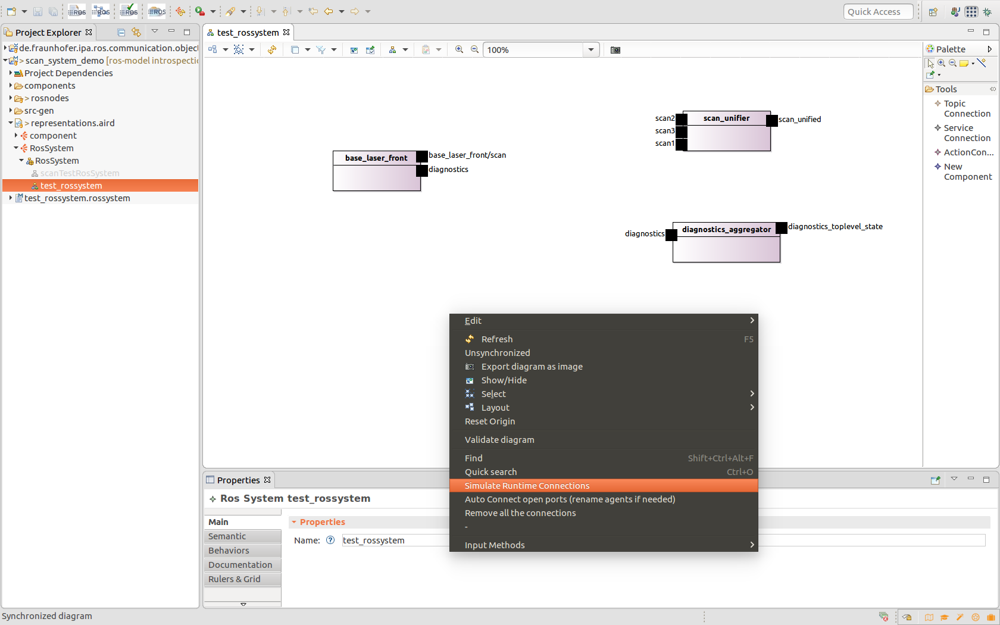
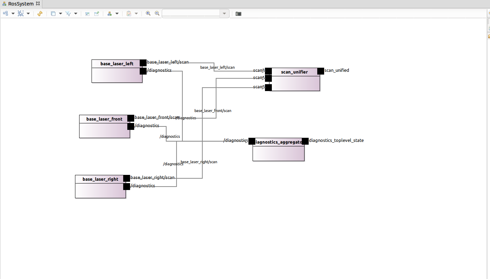

# Introspection at design-time

In ROS by executing a launch file, that defines several nodes includes, the connections will be automatically created through the rosmaster. To "simulate" this behaviour the tooling infrastructure offers a button that creates automatically for the connection that will be wired automatically at runtime, that means: all interfaces with the same name and the same message (communication object) type.

This function can be called from the system graphical editor. To know how to create a system please see the tutorial: [Define a ROS system as a composition of components](NewSystem.md). 

By clicking a right click in the system background, a menu will appear offering 3 help options:

* Simulation Runtime connection : this button will create all connections that are automatically built at runtime. That means interfaces with same name and same message (communication object) type. i.e. for the preivious example diagram the "/diagnostics" topics
* Auto Connect open ports : this button will suggest likely connection. That means join interfaces with the same message (communication obejct type) and will remap consequentelly the names of the ports. For the previous example, the result will be:

 
* Remove all connections : to clean the connection of the model 
